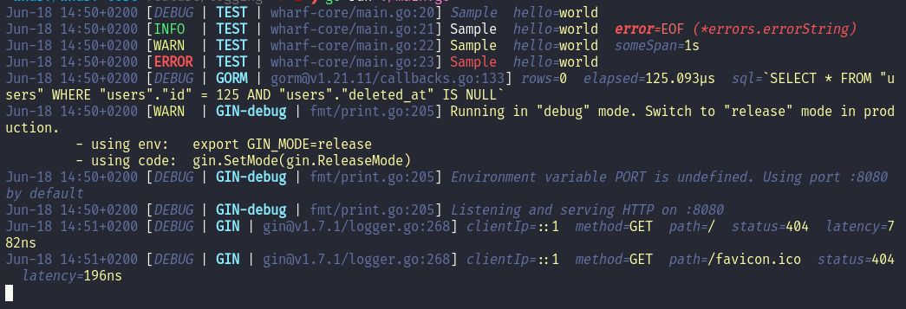

# Wharf logger

## Preview

Sample output of the different pre-packaged `Sink` types.

### pkg/logger/consolepretty



### pkg/logger/consolejson

``` json
{"level":"debug","date":"2021-06-18T15:01:29+02:00","caller":"wharf-core/main.go","line":20,"scope":"TEST","message":"Sample","hello":"world"}
{"level":"info","date":"2021-06-18T15:01:29+02:00","caller":"wharf-core/main.go","line":21,"scope":"TEST","message":"Sample","hello":"world","error":"EOF"}
{"level":"warn","date":"2021-06-18T15:01:29+02:00","caller":"wharf-core/main.go","line":22,"scope":"TEST","message":"Sample","hello":"world","someSpan":1000000000}
{"level":"error","date":"2021-06-18T15:01:29+02:00","caller":"wharf-core/main.go","line":23,"scope":"TEST","message":"Sample","hello":"world"}
{"level":"debug","date":"2021-06-18T15:01:29+02:00","caller":"gorm@v1.21.11/callbacks.go","line":133,"scope":"GORM","rows":0,"elapsed":120476,"sql":"SELECT * FROM \"users\" WHERE \"users\".\"id\" = 125 AND \"users\".\"deleted_at\" IS NULL"}
{"level":"warn","date":"2021-06-18T15:01:29+02:00","caller":"fmt/print.go","line":205,"scope":"GIN-debug","message":"Running in \"debug\" mode. Switch to \"release\" mode in production.\n - using env:\texport GIN_MODE=release\n - using code:\tgin.SetMode(gin.ReleaseMode)"}
{"level":"debug","date":"2021-06-18T15:01:29+02:00","caller":"fmt/print.go","line":205,"scope":"GIN-debug","message":"Environment variable PORT is undefined. Using port :8080 by default"}
{"level":"debug","date":"2021-06-18T15:01:29+02:00","caller":"fmt/print.go","line":205,"scope":"GIN-debug","message":"Listening and serving HTTP on :8080"}
{"level":"debug","date":"2021-06-18T15:01:37+02:00","caller":"gin@v1.7.1/logger.go","line":268,"scope":"GIN","clientIp":"::1","method":"GET","path":"/","status":404,"latency":311}
{"level":"debug","date":"2021-06-18T15:01:38+02:00","caller":"gin@v1.7.1/logger.go","line":268,"scope":"GIN","clientIp":"::1","method":"GET","path":"/favicon.ico","status":404,"latency":391}
```
